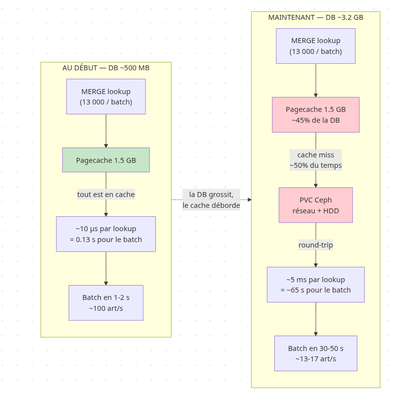

# Rapport de Laboratoire 2 : Neo4j DBLP Loader

* **Groupe ID :** `TayLavAdvDaBa26`
* **Noms :** Loïc Lavorel et Jad Tayan
* **Dépôt Git (Clonable) :** `https://github.com/loiclavorelM/mse-advDaBa-2022/`

---

## 1. Informations de Déploiement (Cluster École)

Voici les identifiants de notre déploiement sur le cluster Rancher de l'école :

* **Namespace :** `tay-lav-adv-daba-26`
* **ID du Pod Neo4j :** `neo4j-deployment-845869665b-9pwls`
* **ID du Pod Loader (Logs) :** `neo4jtp-loader-vtwn2`
* **Credentials Neo4j :**
  * Utilisateur : `neo4j`
  * Mot de passe : `test`

Pour vérifier vous pouvez faire :
```bash
export KUBECONFIG=<votre kubeconfig local>
kubectl logs neo4jtp-loader-vtwn2 -n tay-lav-adv-daba-26
kubectl exec -n tay-lav-adv-daba-26 neo4j-deployment-845869665b-9pwls -- \
  cypher-shell -u neo4j -p test "MATCH (n) RETURN count(n);"
```

---

## 2. Démarche et Fonctionnement de la Solution

Notre solution est divisée en deux parties : l'infrastructure Kubernetes et le script de loading en Python. On a procédé en deux phases :
* **Phase 1 (branche `main`)** : version simple qui marche en local + sur k8s pour des petits subsets
* **Phase 2 (branche `feat/logsandprod`)** : version plus complète pour tenir sur le full dataset (~18 GB)

### 2.1 Infrastructure Kubernetes

L'architecture comprend :

1. **Un PersistentVolumeClaim (PVC)** monté sur `/data` pour la persistance Neo4j
   * Phase 1 : 6 Gi
   * Phase 2 : 30 Gi (on a vite vu que 6 Gi suffisait pas une fois qu'on prend tout le fichier + transaction logs)
2. **Un Deployment Neo4j** (`neo4j:4.4.15-community`), 3 Gi RAM / 2 CPU
3. **Un Service ClusterIP** pour le port Bolt (`7687`)
4. **Un Job (Loader)** qui lance notre script Python encapsulé dans une image Docker (`exalos/neo4jtp:latest`). Le Job s'arrête tout seul quand le chargement se termine.

### 2.2 Déploiement

Pour déployer, il suffit d'aller dans le dossier `deploy` et de lancer le script `deploy.sh`. Si on veut lancer en dev il faut changer la constante `ENVIRONEMENT="DEV"`, sinon `ENVIRONEMENT="PROD"`.

Le script gère aussi le build/push de l'image Docker du loader (skippable avec `SKIP_BUILD=true`).

#### 2.2.1 Environnement de Dev

Pour la partie dev on a monté un cluster local sous Minikube. L'idée c'était de pouvoir itérer rapidement sur la logique d'insert sans polluer le cluster de l'école. Une fois le bon fonctionnement validé en local, la transition vers la prod se fait via le `deploy.sh` qui switch le contexte Kubernetes pour déployer la même architecture sur le cluster école.

### 2.3 Mécanisme de loading

Le chargement du dataset DBLP est géré par un script Python qui stream le fichier JSONL depuis l'URL HTTP, le parse ligne par ligne (chaque ligne = un article JSON) et l'insère par lots dans Neo4j. La variable d'environnement `MAX_NODES` permet de limiter le nombre d'articles traités.

**Stratégie Cypher :**
On utilise `MERGE` sur les nodes (avec contraintes d'unicité sur `_id`) plutôt que `CREATE`. Quand un article cite une référence pas encore lue dans le JSON, le MERGE crée un node Article "stub" (juste l'`_id`). Quand le parser rencontre plus tard la définition de cet article comme entrée top-level, le `ON MATCH SET` complète le titre. Comme ça on n'a pas de doublons et la structure du graphe est cohérente même si l'ordre dans le fichier est arbitraire.

En phase 2 on a optimisé : les **relations** AUTHORED et CITES utilisent `CREATE` au lieu de `MERGE`, avec un garde `exists((:Author)-[:AUTHORED]->(a))` pour ne pas re-créer de relations sur des articles déjà traités. Ça évite à Neo4j de scanner les relations existantes pour chaque insertion.

**Stratégie de statistics :**
Pour prouver que le chargement a bien eu lieu pendant l'exécution, on capture l'état de la DB avant l'insertion (via `MATCH (a:Article) RETURN count(a)` etc.) puis on calcule le delta à la fin dans un bloc `finally`. Ça donne le nombre exact d'articles/auteurs ajoutés par cette session.

---

## 3. Comparaison Phase 1 (main) vs Phase 2 (feat/logsandprod)

On a fait évoluer la solution en deux temps. Voici les changements d'une phase à l'autre :

| Aspect | Phase 1 (`main`) | Phase 2 (`feat/logsandprod`) |
|---|---|---|
| **Stream HTTP** | `requests.get(stream=True)` simple, pas de retry | Retry exponentiel + header `Range` pour reprendre où on s'est arrêté |
| **Cypher relations** | `MERGE` (lent, scan des relations existantes) | `CREATE` avec garde `exists(...)` |
| **PVC** | 6 Gi | 30 Gi |
| **Heap Neo4j** | max=1500m, pas d'initial fixé | initial=1G, max=1G (+ pagecache 1.5G) |
| **Pagecache** | 1G | 1.5G |
| **Logging loader** | Print tous les 100k articles | Print chaque batch avec rate courant |
| **Resume** | Pas possible, repart à zéro à chaque crash | `RESUME_BYTES` env var pour reprendre au byte près |
| **Retry config** | Aucune | `MAX_RETRIES=100`, `RETRY_BACKOFF=1` |

### Pourquoi on a dû migrer vers la phase 2

En phase 1 on a réussi à charger des subsets de quelques centaines de milliers d'articles en local avec Minikube. Ça marchait nickel. Mais quand on a voulu lancer le full dataset (~18 GB) sur le cluster école :

1. **Le stream HTTP cassait** au bout de quelques GB lus (`ChunkedEncodingError`, `ConnectionError`). Sans retry on perdait tout.
2. **Le pod redémarrait** et repartait depuis le début -> on re-streamait des GB déjà ingérés. Le `MERGE` protégeait des doublons mais c'était une perte de temps énorme.
3. **Le PVC de 6 Gi était trop petit** une fois que les transaction logs s'accumulaient.
4. **Les relations en MERGE** devenaient hyper lentes une fois qu'un article avait beaucoup de relations existantes.

D'où les changements de la phase 2 : `Range` HTTP + `RESUME_BYTES` pour reprendre proprement, `CREATE` pour les relations, PVC plus gros, et tuning mémoire Neo4j.

### Résultats observés

| | Phase 1 (test local) | Phase 2 (cluster école, en cours) |
|---|---|---|
| Articles dans la DB au démarrage | 0 | 3 880 985 (résume) |
| Articles processés (session) | ~50k (subset) | 1 402 500+ |
| Taux moyen | ~80 articles/s en local | ~25 articles/s sur cluster (cumulatif), ~13-17/s instantané |
| Temps avant crash/fin | quelques minutes | 15h+ et toujours en cours |

---

## 4. Preuves de Chargement et Statistiques

### 4.1 État actuel (snapshot 2026-05-04 ~12:15 UTC)

Récupéré via `cypher-shell` directement sur le pod Neo4j :

| Compteur | Valeur |
|---|---|
| Articles (`N`) | 5 034 312 |
| Authors (`K`) | 2 335 348 |
| **Total nodes (`N+K`)** | **7 369 660** |

> Note : ce snapshot a été pris avant la fin du loader. La valeur finale est dans le bloc `[DATABASE STATE]` à la fin des logs du pod loader, qui s'imprime quand le Job se termine (ou via `cypher-shell` une fois fini).

### 4.2 Temps de chargement

Le chargement s'est fait en **deux sessions distinctes** à cause de redéploiements pour ajuster la config (resize PVC, tuning Neo4j).

#### Session 1 (branche `main` puis premiers tunings)
* **Premier article inséré (estimé)** : 2026-05-03 ~13:56 UTC
  * Reconstitué via le timestamp du fichier `/data/transactions/neo4j/neostore.transaction.db.0` (premier transaction log fermé à 13:58 UTC)
* **Fin de session 1** : ~19:30 UTC (avant redémarrage Neo4j pour resize PVC)
* **Articles chargés** : 3 880 985 (reportés dans le `[COUNT]` initial de la session 2)

> Les logs détaillés de la session 1 ne sont plus accessibles (pods supprimés lors des redéploiements).

#### Session 2 (branche `feat/logsandprod`, en cours)
Visible dans `kubectl logs neo4jtp-loader-vtwn2` :

```
[START] 2026-05-03T19:33:14.777006+00:00 – Source: http://vmrum.isc.heia-fr.ch/files/...
[CONFIG] MAX_NODES=-1, BATCH_SIZE=500
[COUNT] Articles=3880985 Authors=1652080 CITES=17540159 AUTHORED=4939408
...
[BATCH #2805] 1402500 articles | 55327s écoulés | 25 articles/s
```

* **Start** : 2026-05-03 19:33:14 UTC
* **Articles processés à 12:15 UTC** : 1 402 500 (delta de cette session)
* **Durée écoulée à 12:15 UTC** : 55 327 s (~15h 22min)
* **End / Duration finale** : à extraire du bloc `[END] / [DURATION]` une fois le `finally` du loader exécuté

#### Wall-clock total estimé
* Premier article (3 mai 13:56 UTC) → fin estimée
* Au moment de la rédaction : déjà ~22h écoulées en cumulé, et probablement plusieurs heures encore avant fin du fichier complet.

### 4.3 Comment lire nos logs

Les logs du pod loader contiennent toutes les infos demandées (`kubectl logs neo4jtp-loader-vtwn2 -n tay-lav-adv-daba-26`) :

1. **`[START]`** : timestamp ISO UTC du début de session
2. **`[COUNT]` initial** : état de la DB avant l'insertion (baseline)
3. **`[BATCH #N]`** : progression continue avec articles chargés, secondes écoulées et taux d'insertion
4. **`[END]`** : timestamp ISO UTC de fin (imprimé par le `finally`)
5. **`[DURATION]`** : durée totale en secondes
6. **`[SESSION RESULTS]`** : delta articles/auteurs/nodes ajoutés par cette session
7. **`[DATABASE STATE]`** : état global final du graphe

Pour calculer le temps total : `[DURATION]` donne le wall-clock de la session 2. Pour la session 1 il faut estimer via les timestamps des fichiers Neo4j (`neostore.transaction.db.0`).

---

## 5. Pistes sur les performances et limites observées

Bon, c'est la partie où on s'est vraiment arrachés les cheveux. Au début ça tournait à environ 500~600 au début, puis 80-100 articles/s, ce qui nous allait bien. Mais petit à petit c'est descendu jusqu'à 13-17 articles/s. Et ce qui est bizarre c'est que le CPU est à moins de 2% (autant côté Neo4j que côté loader), donc on calcule rien, on attend juste. Pour nous c'était clair : on est limité par la vitesse d'écriture.

### 5.1 La cause potentielle à notre avis : les lookups MERGE qui sortent du cache

Si on regarde notre Cypher, pour chaque batch de 500 articles on fait à peu près :

* 500 lookups sur l'index `Article._id` (le MERGE de l'article)
* environ 5 auteurs par article × 500 = ~2 500 lookups sur `Author._id`
* environ 20 références par article × 500 = ~10 000 lookups sur `Article._id`

Ça fait à peu près **13 000 lookups index par batch**, ce qui est beaucoup.

Au début la DB est petite et tient en entier dans le pagecache (1.5 GB), donc tous les lookups sont en RAM, ~10 µs chacun. Mais à un moment la DB devient plus grosse que le pagecache, et là les pages B-tree de l'index tiennent plus toutes en mémoire. Du coup une partie des lookups doivent aller chercher la page sur le disque (Ceph), et là ça prend ~5 ms à chaque fois. Soit 500x plus lent.

#### Schéma — pourquoi ça ralentit autant



Les chiffres collent à peu près avec ce qu'on voit dans les logs (30-50 s par batch en fin de course). Pour nous ça confirme que c'est bien le coût des lookups qui explose, et pas un autre truc.

### 5.2 Les checkpoints longs

Au début on pensait que c'était les checkpoints Neo4j qui ralentissaient tout. Dans `/logs/debug.log` du pod Neo4j on voit :

```
checkpoint started @ 23:35  → completed in 16m 36s
checkpoint started @ 00:07  → completed in 17m  8s
checkpoint started @ 07:17  → completed in 18m 26s
```

Ils tournent toutes les 15 min mais prennent 17 min, donc on est en checkpoint en quasi permanence. Mais :

* Un checkpoint flush au pire les dirty pages du pagecache, donc max 1.5 GB
* Sur un disque normal ça devrait prendre 30 sec à 2 min grand maximum
* Là ça met 17 min pour 1.5 GB = ~1.5 MB/s, ce qui est bizarre

### 5.3 Pourquoi on ne peut pas juste mettre plus de pagecache

On a essayé. Avec les 3 Gi RAM du TP, le calcul c'est :

* Heap JVM 1 Gi + pagecache 1.5 Gi + overhead JVM (~500 Mi) = on est déjà à 3 Gi
* On a tenté pagecache à 2 Gi -> OOM kill du conteneur direct

Du coup tant que la DB dépasse 1.5 Gi, on aura forcément des cache miss.

### 5.4 Le stockage Ceph

Le PVC est sur Ceph (on l'a vu avec `df -h /data` → `/dev/rbd19`). Ceph c'est très bien pour la persistance distribuée mais pour notre cas (beaucoup de petits writes random), c'est plus lent qu'un SSD local. Et chaque cache miss = un aller-retour réseau vers Ceph.

### 5.5 Pistes d'amélioration

On s'en est rendu compte un peu tard, mais il y a plusieurs pistes qui restent dans le cadre du TP et qui pourraient probablement améliorer les choses. On les liste ici pour être honnêtes sur ce qu'on aurait pu faire mieux.

* **Refondre le Cypher en plusieurs étapes avec dédup côté Python** : actuellement on a un gros MERGE imbriqué dans des UNWIND imbriqués. Le truc c'est que dans un batch de 500 articles, plein de refs et d'auteurs reviennent plusieurs fois (les papers populaires sont cités par plein d'autres). Si on déduplique côté Python avant d'envoyer, et qu'on découpe en 4 requêtes séparées (MERGE Articles, MERGE Authors, CREATE AUTHORED, CREATE CITES), on diviserait le nombre de lookups par 2 ou 3. C'est apparemment l'optimisation classique pour le bulk insert Neo4j. Probablement le plus gros gain accessible mais c'est aussi le truc le plus risqué à toucher tard, donc on a préféré pas y toucher.

* **Trier les IDs avant le MERGE** : un simple `.sort()` côté Python sur les listes d'IDs avant de les envoyer. Le B-tree de Neo4j accède aux pages dans l'ordre, donc meilleure localité cache. Petit gain probable.

* **Réduire le heap pour donner plus de pagecache** : on a heap=1G + pagecache=1.5G + overhead JVM ~500M = 3G pile. On pourrait essayer heap=512M + pagecache=2G. Le heap 512M devrait suffire vu qu'on fait pas de gros agrégats, juste des MERGE. Risque : si une requête bouffe trop de heap on a un out of memory. (ce qui est déjà arrivé)

* **Plugin APOC + `apoc.periodic.iterate(parallel: true)`** : APOC permet de splitter une insertion en plusieurs sous-transactions parallèles côté serveur. Il suffit d'ajouter `NEO4JLABS_PLUGINS=["apoc"]` dans le deployment. Combiné à la dédup, ça pourrait utiliser les 2 cœurs CPU. Mais ça ajoute de la complexité et on aurait dû le mettre en place plus tôt.

* **Tri Chronologique** : Ordonner le dataset par date de publication (du plus ancien au plus récent) garantirait que les nœuds référencés existent déjà lors de la création des relations CITES, limitant ainsi la création de coquille vide et les Cache Misses lors de la mise à jour différée des nœuds.

* **Ingestion multi-passes (Two-Pass Load)** : Séparer la création des entités (Articles, Auteurs) de la création des arêtes (CITES, AUTHORED) en deux lectures distinctes du fichier permettrait peut-être d'alléger considérablement la charge pesant sur le Heap.

* **Réduction de l'empreinte de l'Index B-Tree** : Remplacer les clés primaires alphanumériques (_id au format String) par des entiers séquentiels, permettant de conserver une plus grande partie de la topologie en mémoire vive.
---

## 6. Annexe : commandes utiles

```bash
# Setup kubeconfig
export KUBECONFIG=<path>/kubeconfig.yaml
kubectl config set-context --current --namespace=tay-lav-adv-daba-26

# Voir les logs du loader
kubectl logs neo4jtp-loader-vtwn2

# Suivre en live
kubectl logs -f neo4jtp-loader-vtwn2

# Snapshot direct DB
kubectl exec neo4j-deployment-845869665b-9pwls -- \
  cypher-shell -u neo4j -p test \
  "MATCH (a:Article) WITH count(a) AS n MATCH (p:Author) RETURN n AS articles, count(p) AS authors, n + count(p) AS total;"

# Port-forward pour accéder au browser Neo4j en local
kubectl port-forward svc/neo4j-service 7474:7474 7687:7687
# puis ouvrir http://localhost:7474
```